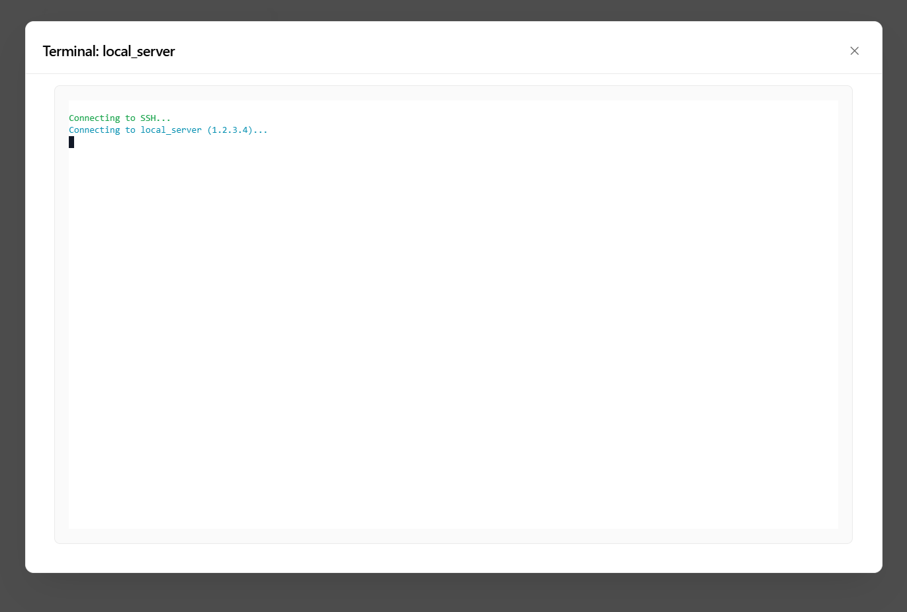

# Sible - Lightweight Ansible Orchestrator

[](https://adam-benyekkou.github.io/Sible/)
[](LICENSE)

> **Sovereign Infrastructure Management for SREs and DevOps.**
> A modern, reactive, no-bloat UI for Ansible. Built with **FastAPI**, **HTMX**, and **PicoCSS**.

## Core Value

**Execute Ansible playbooks on your servers instantly.**
Sible connects to your inventory via SSH, runs your automation, and streams the logs directly to your browser in real-time. No complex agents, just standard SSH.

---

## Key Features

Sible is designed to bridge the gap between complex enterprise towers (AWX/Tower) and raw CLI usage.

### Modern Operator Experience
*   **Reactive Dashboard**: Instant feedback via HTMX and WebSocket streaming. No page reloads.
*   **Web Terminal**: Built-in, secure SSH terminal to connect directly to your inventory hosts from the browser.
*   **Mobile Optimized**: Fully responsive UI for managing infrastructure on the go.

### Automation & Orchestration
*   **Template Library**: Bootstrap new playbooks instantly from a built-in library of best-practice blueprints.
*   **Cron Scheduling**: Native job scheduler for recurring tasks (backups, patching, monitoring).
*   **Real-time Logs**: Watch Ansible execution streams live via WebSockets.
*   **Linting**: Integrated `ansible-lint` checks your code as you type.

### Security & Governance
*   **RBAC**: Three-tier role system (Admin, Operator, Watcher) for granular access control.
*   **Secret Vault**: AES-256 encrypted storage for SSH keys, API tokens, and sensitive variables.
*   **JIT Injection**: Secrets are injected into Ansible processes at runtime and never persisted to disk.

---

## Screenshots

| Playbook Management | Interactive Terminal |
|:---:|:---:|
|  |  |

| Inventory | Job History |
|:---:|:---:|
|  |  |

*(See [Documentation](https://adam-benyekkou.github.io/Sible/) for more views)*

---

## Quick Start

### Docker Compose (Recommended)

The fastest way to get started is via Docker Compose.

1.  Create a `docker-compose.yml`:

```yaml
services:
  sible:
    image: ghcr.io/adam-benyekkou/sible:latest
    container_name: sible
    restart: unless-stopped
    ports:
      - "8000:8000"
    volumes:
      # Persist the database and app settings
      - ./data:/app/data
      # Mount your Ansible playbooks
      - ./playbooks:/app/infrastructure/playbooks
      # Mount your SSH keys (Optional, for pre-existing keys)
      - ~/.ssh:/root/.ssh:ro
    environment:
      - SIBLE_SECRET_KEY=change_me_to_something_secure
      - SIBLE_Use_DOCKER=true
```

2.  Run the container:

```bash
docker-compose up -d
```

3.  Access the dashboard at `http://localhost:8000`
    *   **Default User**: `admin`
    *   **Default Password**: `admin` (Change this immediately!)

---

## Documentation

Full documentation is available at **[adam-benyekkou.github.io/Sible](https://adam-benyekkou.github.io/Sible/)**.

*   [Installation Guide](https://adam-benyekkou.github.io/Sible/guide/installation)
*   [Feature Overview](https://adam-benyekkou.github.io/Sible/features/orchestration)
*   [REST API Reference](https://adam-benyekkou.github.io/Sible/guide/api)

---

## Tech Stack

Sible is built on a "Zero-Bloat" philosophy, avoiding heavy frontend frameworks in favor of server-side rendering and hypermedia.

*   **Backend**: Python 3.11, FastAPI, SQLModel (SQLite), Ansible Runner
*   **Frontend**: Jinja2, HTMX, Alpine.js, PicoCSS
*   **Real-time**: WebSockets, Server-Sent Events (SSE)
*   **Security**: BCrypt, Fernet (Symmetric Encryption), JWT

---

## Contributing

Contributions are welcome! Please check the [Contributing Guide](CONTRIBUTING.md) for details on setting up your environment and our code standards.

### Quick Dev Setup

```bash
# 1. Clone the repo
git clone https://github.com/adam-benyekkou/Sible.git
cd Sible

# 2. Install dependencies
pip install -r requirements.txt

# 3. Run the dev server
uvicorn app.main:app --reload
```

---

## License

MIT © [Adam Benyekkou](https://github.com/adam-benyekkou)
