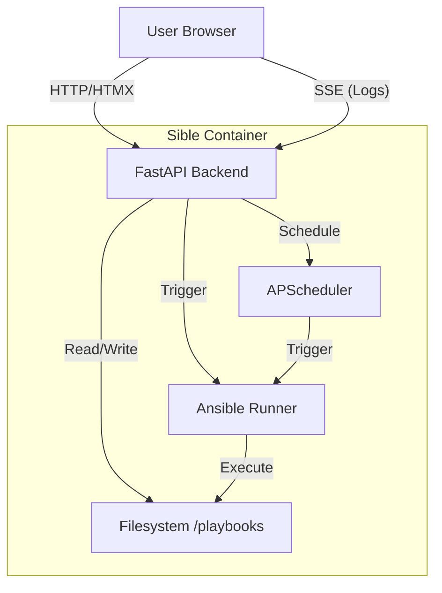

# Architecture & Design

## System Architecture

Sible runs as a **single container** application.



## Directory Structure

```text
/sible
├── /app
│   ├── main.py        # Entry point, App initialization
│   ├── routes.py      # HTTP endpoints (HTMX handlers)
│   └── tasks.py       # Background task logic & Scheduler
├── /templates
│   ├── layout.html    # Master template (Dockge style)
│   └── partials/      # Fragments for HTMX (sidebar items, terminal lines)
├── /static
│   └── css/           # minimal custom CSS
├── /playbooks         # Docker Volume Mount
└── Dockerfile
```

## UI Architecture (Frontend)

- **Layout:** CSS Grid based 2-column layout.
  - `sidebar`: Fixed width (e.g., 300px), scrollable. Lists files.
  - `main`: Flex grow. Contains the Tabs (Editor/Logs).
- **HTMX:** Used for navigating files. Clicking a sidebar item performs a GET request to replace the `main` content area with the editor for that file.
- **Alpine.js:** Handles strictly client-side interactions:
  - Toggling active tabs (Code vs Terminal).
  - Showing/Hiding the Schedule modal.
  - Initializing the Ace Editor instance (binding to a textarea).
- **SSE:** `/stream/{playbook_name}` endpoint pushes log lines as HTML fragments to be appended to the terminal window.

## Backend Components

1. **FastAPI App:** Serves static assets and HTML templates.
2. **File Manager:** Glob patterns to find `.yaml` files.
3. **Job Queue:** Simple in-memory locking or async queue to prevent overlapping runs of the same playbook (if desired) or managing concurrent runs.
4. **Scheduler:** `APScheduler` with `SQLAlchemyJobStore` (SQLite) to persist schedules across restarts.
