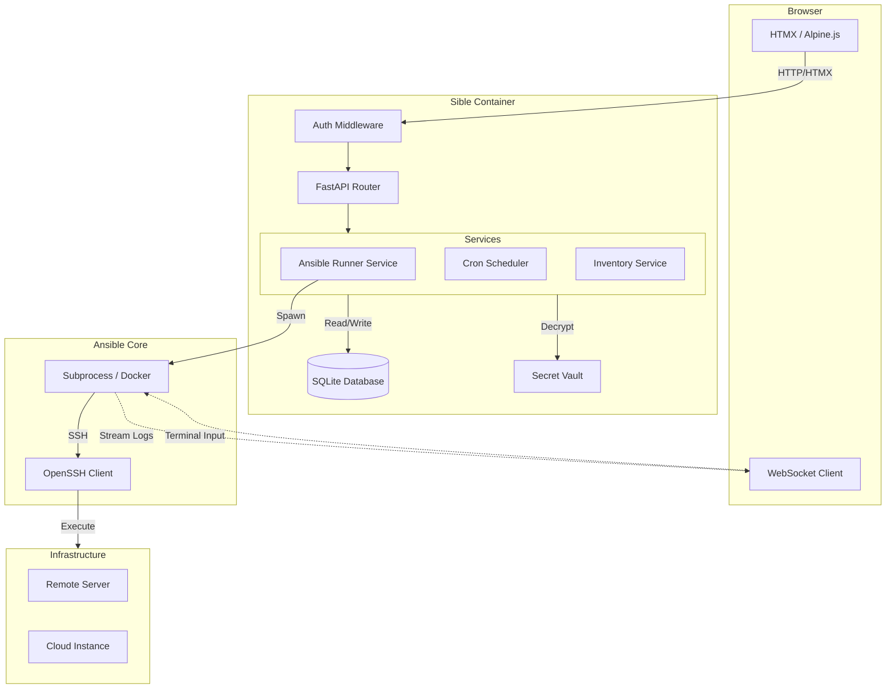

# Architecture

Sible follows a modern, decoupled architecture designed for high throughput and security.

## Tech Stack
- **Backend**: FastAPI (Python)
- **Database**: SQLModel (ORM)
- **Frontend**: HTMX / PicoCSS
- **Orchestration**: Ansible Subprocesses
- **Communication**: WebSockets (Real-time logs)

## Component Overview

## Data Flow
1.  **Request**: User triggers a playbook via the HTMX UI.
2.  **Validation**: Request is authenticated and RBAC checks are performed.
3.  **Execution**: The Runner Service spawns an isolated Ansible subprocess (or Docker container).
4.  **Streaming**: stdout/stderr are captured in real-time and pushed to the browser via WebSockets.
5.  **Persistence**: Job status and audit logs are written to SQLite.

